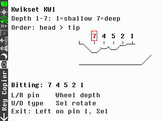
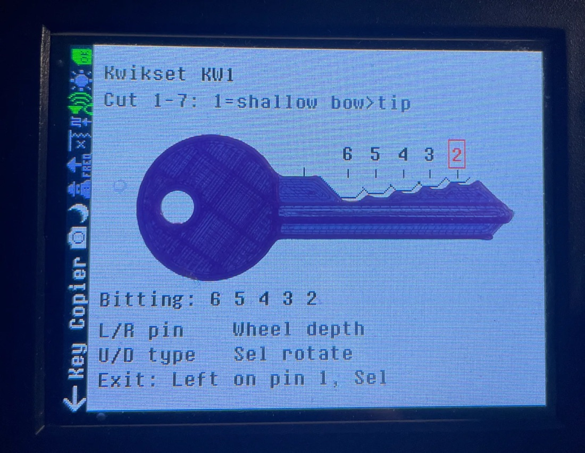

# Key Copier for PortaPack Mayhem

Measure the **bitting** (cut depths) of a physical key you own on a HackRF **PortaPack** running
[Mayhem firmware](https://github.com/portapack-mayhem/mayhem-firmware). Put the key on the screen, align it with the
drawn outline, adjust each pin's depth until the outline matches, and read the code off the screen.

This is a port of **[KeyCopier](https://github.com/zinongli/KeyCopier) for Flipper Zero** by zinongli (MIT). The key
format data and the contour algorithm come from there; the user interface, controls and the PortaPack build tooling
are new. See [NOTICE](NOTICE).

> **Status:** works on the author's HackRF One R10 + PortaPack H2 with Mayhem **v2.4.0** (one unit, tested with printed
> KW1 keys). Not yet part of official Mayhem. See [Install](#install) for what that means in practice.

## What it does

- Draws a life-size outline of the key blade for **23 key formats** (mostly US residential and a few automotive/motorcycle).
- Each pin's depth is set with the dial; the outline updates immediately, including the neighbouring-cut slopes.
- Shows the resulting **bitting** as a list of numbers, read head to tip.
- Works upright or **turned on its side** (landscape): the outline and all text rotate, and the buttons are re-mapped to
  match how you hold the device.

Supported formats: Kwikset KW1, Schlage SC4, Arrow AR4, Master Lock M1, American AM7, Yale Y2, Yale Y11, Sargent S22,
National NA25, National NA12, Corbin CO88, Lockwood LW4, Lockwood LW5, Russwin RU45, Weiser WR3, Best (A2) SFIC,
Ford H75, Chevrolet B102, Dodge Y159, Kawasaki KA14, Suzuki SUZ18, Yamaha YM63, RV (FIC, GL, Bauer).

## Screenshots

Screenshots taken on the device (Kwikset KW1, bitting 7-4-5-2-1). Left: upright. Right: landscape, the way it looks when the
device is turned on its side.

<p>
  
  &nbsp;&nbsp;
  
</p>

A printed KW1 key laid on the screen with the depths adjusted to match it (landscape mode; the on-screen hint text in this
photo is from an earlier build):

<p>
  
</p>

## Controls

| Control | Upright | Device turned on its side |
|---|---|---|
| Dial | change the depth of the selected pin | same |
| Centre button | rotate the outline 90° (0 → 90 → 180 → 270) | same |
| Left / Right | previous / next pin | the buttons that are now left/right *for you* |
| Up / Down | previous / next key format | the buttons that are now up/down *for you* |
| Exit | press toward the title bar past the end of the key until the back arrow is focused, then the centre button; or touch the arrow | same (hint is shown on screen) |

The on-screen footer always shows the controls for the current orientation.

## Depth numbering

Numbers follow the **manufacturer specification** for each format: the smallest number is the shallowest cut and the
code is read from the **head (bow) to the tip**. For Kwikset KW1 that is 1 = 0.329" … 7 = 0.191" in 0.023" steps.

Some key *generators* and decoders number the other way round or start at 0. Always check which convention a tool uses
before copying a code from one tool to another.

## Install

A single `.ppma` file **cannot** be dropped onto a stock Mayhem installation: Mayhem external apps call into the firmware
at fixed addresses, so an app only works with the exact firmware image it was linked against. Adding a new app changes
that image. Details and the experiments behind this are in [docs/COMPATIBILITY.md](docs/COMPATIBILITY.md).

### Ready-made packages (recommended)

A [GitHub Actions workflow](.github/workflows/build.yml) builds Mayhem together with Key Copier for each Mayhem release and
publishes the result under [Releases](../../releases) (`key-copier_mayhem-<version>.zip`: `FIRMWARE/`, `APPS/`, `INSTALL.txt`).
It checks once a day for a new stable Mayhem release and can be started by hand for any tag or branch. To update after a new
Mayhem release: take the new zip, unpack it into the root of the SD card (your `SETTINGS` are not touched) and flash the `.bin`
from `FIRMWARE/` with Flash Utility. If the build fails (the app no longer fits the new release) the workflow run says so.

### Build it yourself

Until the app is merged into Mayhem, you build a matching firmware **and all apps together**:

1. Back up your SD card (`FIRMWARE`, `APPS`, `SETTINGS`).
2. `scripts/build.sh v2.4.0` (needs Docker; builds Mayhem v2.4.0 with Key Copier and a version suffix; no argument = latest stable).
3. Unpack `dist/key-copier_mayhem-v2.4.0.zip` into the root of the SD card.
4. On the device: **Utilities → Flash Utility**, choose `portapack-mayhem_<version>-kc1.bin`.
5. Open **Utilities → Key Copier**.

The version suffix makes the firmware ignore stock `.ppma` files, which would crash it. To go back, flash the official
`.bin` the same way and restore your `APPS` backup.

Flashing custom firmware is at your own risk. The usual recovery (DFU mode) applies.

## Build

```bash
scripts/build.sh [mayhem-tag-or-branch] [version-suffix]    # default: latest stable release, suffix -kc1
```

The script clones Mayhem at the tag, copies `app/key_copier/` into `firmware/application/external/`, registers it
(`scripts/integrate.py`, which handles both the classic `external.ld` and the newer tier system) and runs the official Docker build image. `tools/gen_formats.py` regenerates
`app/key_copier/key_formats.cpp` from KeyCopier's `key_formats.c`.

## Calibration

The outline is drawn in real millimetres. The scale constant `kInchPerPx` in `app/key_copier/ui_key_copier.cpp` is set for
the H2 screen (visible area about 50 × 65 mm, 240 × 320 px, about 0.205 mm per pixel). Screens differ between PortaPack
revisions; if the outline is not life-size on yours, measure the visible area and adjust the constant.

## Responsible use

Use it on keys you own or are authorised to handle. Reading a key's cut depths is routine for locksmiths and hobbyists,
but copying keys without permission may be illegal where you live.

## Credits and license

- Key formats and contour algorithm: **KeyCopier** by zinongli, MIT, Copyright (c) 2024 zinongli
  (`app/key_copier/LICENSE-KeyCopier-MIT`).
- Built on the [Mayhem firmware](https://github.com/portapack-mayhem/mayhem-firmware) (GPL).
- The combined work is distributed under **GPL-2.0-or-later** ([LICENSE](LICENSE)); the MIT licence is compatible.
- Key dimensions come from public manufacturer specifications referenced by KeyCopier. Brand names are used only to
  identify key types. This project is independent and not affiliated with or endorsed by Mayhem, the manufacturers or
  the KeyCopier author.
